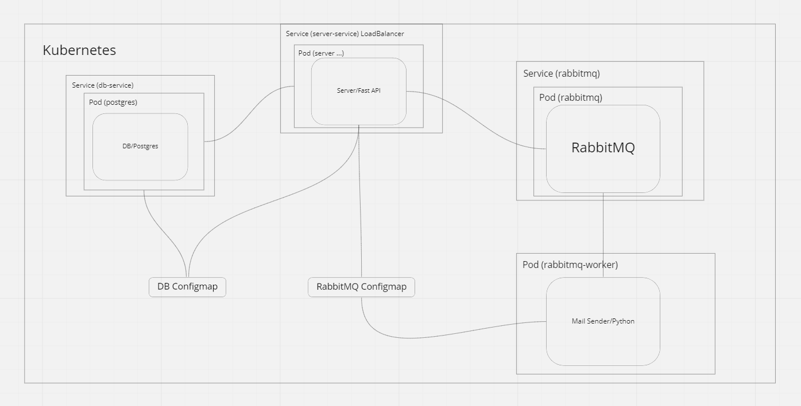

# System-Design-Practice

## Project Description:
I've decided to learn some system design principles, patterns and actually build some stuff and put it here. 

#### You'll need docker and docker-compose installed for every project here

### Project 0: Simple load balancing of a stateless server app

#### Description:
Couple of a simple python/flask app instances with an nginx as a load balancer in front, everything runs in docker 
containers. Here `nginx` operates as a load balancer and is using `Round Robin` principle, to change that you have 
to change it's configuration file (`./nginx/nginx.conf`) according to this link 
http://nginx.org/en/docs/http/load_balancing.html

#### Technologies used:
* Python/Flask
* Nginx
* Docker/Docker-Compose

#### How to run:
Run command: `docker-compose up`

### Project 1: Asynchronous messaging with RabbitMQ 

#### Description:
A simple server with one endpoint receiving commands for asynchronous execution which puts messages to the Rabbit MQ, and 
a worker app which is listening to the Rabbit MQ and executes command once it's received. This examples is copied from 
this source: https://medium.com/better-programming/background-processing-with-rabbitmq-python-and-flask-5ca62acf409c
// TODO add frontend app for receiving async results 

#### Technologies used:
* Python/Flask
* RabbitMQ
* Docker/Docker-Compose

#### How to run:
Run command: `docker-compose up`

### Project 2: Example of building a simple app in Kubernetes

#### Description:
A server with external IP on request save it in the database and sends a message to the RabbitMQ, a simple 
micro-service (MailSender) listening to the RabbitMQ receives the message and sends according mail to someone

#### Technologies used:
* Python/FastAPI
* RabbitMQ
* Docker/Docker-Compose
* Kubernetes

#### Architecture:

#### How to run:
* Setup Kubernetes with docker desktop
* Run `kubectl apply -f .` in the `k8` folder
* Destroy `kubectl delete all --all`

### Project 3: Caching with Redis/Spring Boot

#### Description:
Spring Boot server connected to a postgres DB and Reddis caching retrieved data to redis 

#### Technologies used:
* Redis
* Java/Spring Boot
* Docker/Docker-Compose

#### How to run:
* Run `docker compose up`

